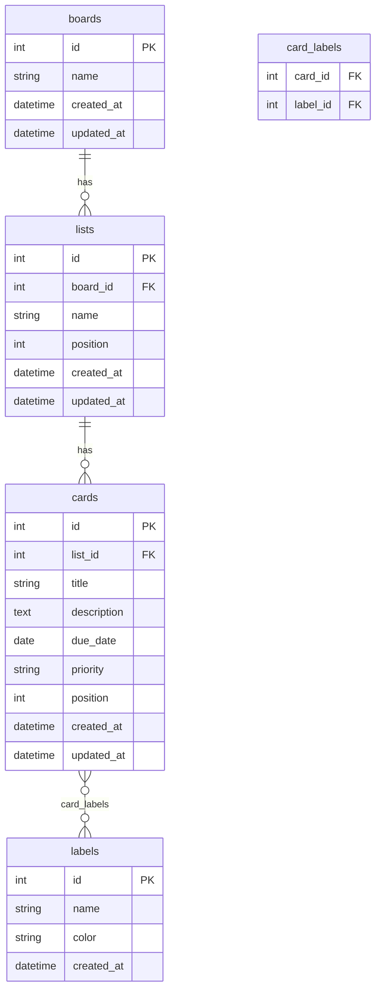

# データベース設計

## ER図

## エンティティ定義

| エンティティ | 説明 |
|---|---|
| boards | ボード。タスク管理の最上位単位 |
| lists | リスト。ボード内のカラム（例：To Do / 進行中 / 完了） |
| cards | カード。個々のタスク |
| labels | ラベル。カードに付与できるタグ |
| card_labels | カードとラベルの中間テーブル（多対多） |

## リレーション

| リレーション | 種別 | 説明 |
|---|---|---|
| boards → lists | 1対多 | 1つのボードは複数のリストを持つ |
| lists → cards | 1対多 | 1つのリストは複数のカードを持つ |
| cards ↔ labels | 多対多 | 1枚のカードに複数ラベルを付けられる |
