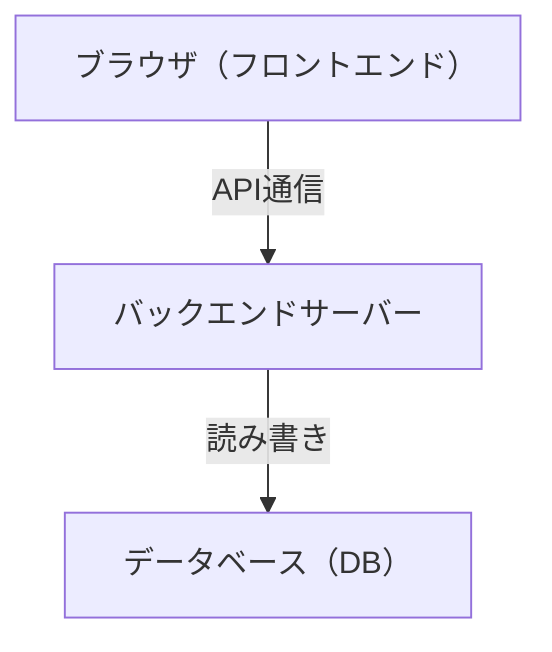
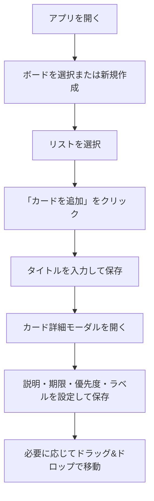
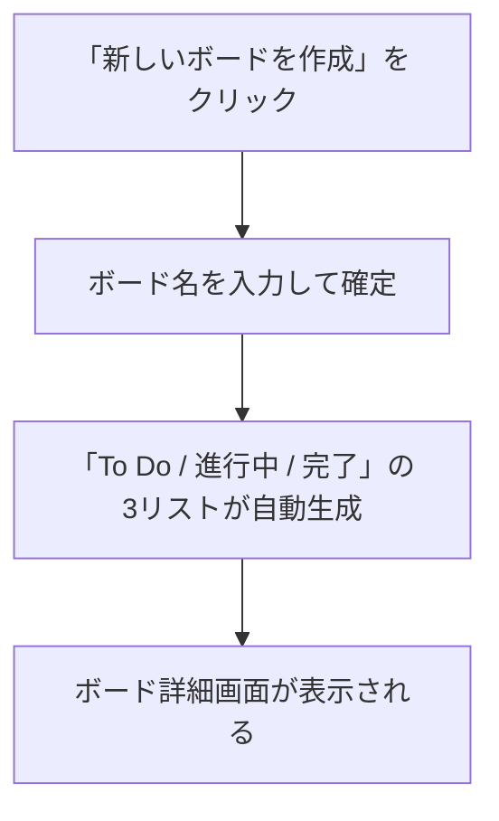
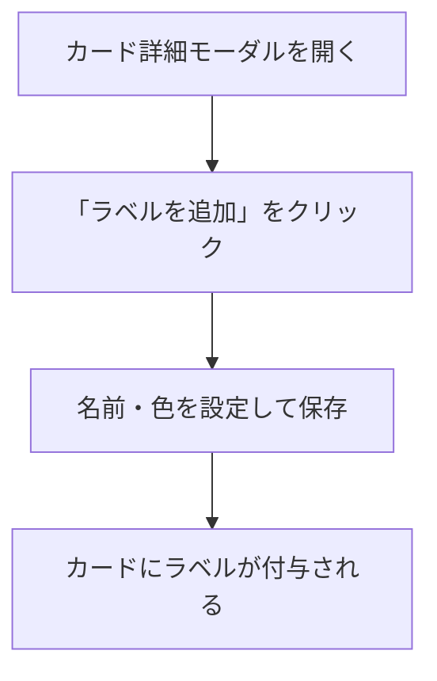
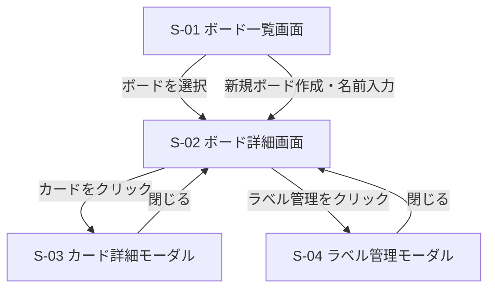
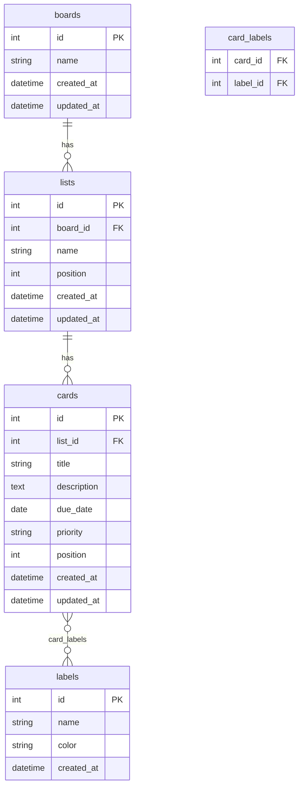

# 要件定義書

## プロジェクト概要

| 項目 | 内容 |
|---|---|
| プロジェクト名 | Trello風タスク管理アプリ |
| 作成日 | 2026-05-07 |
| バージョン | 1.0 |

個人向けTrello風タスク管理Webアプリ。PC・スマートフォンのブラウザで動作する。

---

## 背景・目的

ITスクールのカリキュラム課題として、Webアプリケーション開発の一連の工程（要件定義→設計→実装→テスト）を体験することを目的とする。

題材として、実際に自分が使えるタスク管理アプリを開発する。

---

## ユーザー

- 1人（ログイン不要）

---

## システム構成

フロントエンド・バックエンド・DBの3層構成とする。

---

## ユースケース

| # | アクター | ユースケース |
|---|---|---|
| UC-1 | ユーザー | ボードを作成・切り替え・削除する |
| UC-2 | ユーザー | ボード内にリストを追加・削除・名前変更する |
| UC-3 | ユーザー | リストにカードを追加し、タイトル・説明・期限・優先度を設定する |
| UC-4 | ユーザー | カードにラベルを作成して付与する |
| UC-5 | ユーザー | カードをドラッグ&ドロップでリスト間・リスト内で移動する |
| UC-6 | ユーザー | カードの詳細をモーダルで確認・編集する |
| UC-7 | ユーザー | カードを削除する |

---

## 操作フロー

### メインフロー：カードを作成して管理する

### サブフロー：ボードを新規作成する

### サブフロー：ラベルを作成してカードに付与する

---

## 機能要件

### ボード

| # | 機能 |
|---|---|
| B-1 | ボードを作成できる |
| B-2 | ボードを削除できる |
| B-3 | ボードの名前を変更できる |
| B-4 | 複数ボードを切り替えて表示できる |

### リスト

| # | 機能 |
|---|---|
| L-1 | ボード内にリストを追加できる |
| L-2 | リストを削除できる |
| L-3 | リストの名前を変更できる |
| L-4 | 新しいボード作成時に「To Do / 進行中 / 完了」を自動で作成する |

### カード

| # | 機能 |
|---|---|
| C-1 | リストにカードを追加できる |
| C-2 | カードを削除できる |
| C-3 | カードにタイトル（必須）を設定できる |
| C-4 | カードに説明文を設定できる |
| C-5 | カードに期限を設定できる |
| C-6 | カードに優先度（高・中・低）を設定できる |
| C-7 | カードにラベル（名前・色）を設定できる |
| C-8 | カードをドラッグ&ドロップでリスト間の移動・同一リスト内での並び替えができる |
| C-9 | カードの詳細をモーダル（ポップアップ）で表示・編集できる |

### ラベル

| # | 機能 |
|---|---|
| La-1 | ラベルを作成できる（名前・色を設定） |
| La-2 | ラベルを削除できる |
| La-3 | カードに複数のラベルを付けられる |

---

## 画面一覧・画面遷移

### 画面一覧

| 画面ID | 画面名 | 概要 |
|---|---|---|
| S-01 | ボード一覧画面 | 作成済みボードの一覧表示・ボード新規作成 |
| S-02 | ボード詳細画面 | リスト・カードの表示・操作のメイン画面 |
| S-03 | カード詳細モーダル | カードの詳細表示・編集 |
| S-04 | ラベル管理モーダル | ラベルの作成・削除 |

### 画面遷移図

### 各画面のUI仕様

#### S-01 ボード一覧画面
- ボードをカード形式で一覧表示する
- 各ボードカードにボード名・削除ボタンを表示する
- 「新しいボードを作成」ボタンを表示する
- ボード名はクリックでインライン編集できる

#### S-02 ボード詳細画面
- ヘッダーにボード名・ボード一覧への戻るリンクを表示する
- リストを横並びで表示する
- 各リストにリスト名・カード一覧・「カードを追加」ボタン・リスト削除ボタンを表示する
- 「リストを追加」ボタンを最右端に表示する
- カードにはタイトル・優先度・期限・ラベルをコンパクトに表示する
- カードはドラッグ&ドロップで移動可能

#### S-03 カード詳細モーダル
- タイトル（必須・テキスト入力）
- 説明文（任意・テキストエリア）
- 期限（任意・日付ピッカー）
- 優先度（任意・高/中/低のセレクト）
- ラベル（任意・付与済みラベル表示＋追加ボタン）
- 削除ボタン・閉じるボタン
- 変更の保存タイミングは基本設計フェーズで決定する

#### S-04 ラベル管理モーダル
- 既存ラベル一覧（名前・色・削除ボタン）
- 新規ラベル作成フォーム（名前入力・カラーピッカー・追加ボタン）

---

## エラー時の挙動

| # | 状況 | 挙動 |
|---|---|---|
| E-1 | カードタイトルが未入力で保存しようとした | 保存せず、入力欄にエラーメッセージを表示する |
| E-2 | ボード名が未入力で作成しようとした | 作成せず、入力欄にエラーメッセージを表示する |
| E-3 | リスト名が未入力で作成しようとした | 作成せず、入力欄にエラーメッセージを表示する |
| E-4 | ラベル名が未入力で作成しようとした | 作成せず、入力欄にエラーメッセージを表示する |
| E-5 | ボードを削除しようとした | 確認ダイアログを表示し、確認後に削除する |
| E-6 | カードを削除しようとした | 確認ダイアログを表示し、確認後に削除する |
| E-7 | APIリクエストが失敗した（通信エラー・サーバーエラー） | 画面上部にエラートーストを表示し、操作が保存されなかったことをユーザーに通知する |

---

## 非機能要件

| # | 分類 | 要件 |
|---|---|---|
| N-1 | レスポンシブ | スマートフォン・PCどちらでも使えるレスポンシブデザイン |
| N-2 | データ永続化 | データはバックエンド経由でDBに保存する |
| N-3 | 認証 | ログイン・ユーザー登録は不要 |
| N-4 | ブラウザ対応 | Chrome（最新版）・Safari（最新版）・Firefox（最新版）で動作すること |
| N-5 | パフォーマンス | カードが100枚以上ある場合でも、ドラッグ&ドロップが遅延なく動作すること |
| N-6 | アクセシビリティ | キーボードのみでモーダルの開閉・フォーム操作ができること |
| N-7 | API通信 | フロントエンドとバックエンドはREST APIで通信する |

---

## ER図

### エンティティ定義

| エンティティ | 説明 |
|---|---|
| boards | ボード。タスク管理の最上位単位 |
| lists | リスト。ボード内のカラム（例：To Do / 進行中 / 完了） |
| cards | カード。個々のタスク |
| labels | ラベル。カードに付与できるタグ |
| card_labels | カードとラベルの中間テーブル（多対多） |

### リレーション

| リレーション | 種別 | 説明 |
|---|---|---|
| boards → lists | 1対多 | 1つのボードは複数のリストを持つ |
| lists → cards | 1対多 | 1つのリストは複数のカードを持つ |
| cards ↔ labels | 多対多 | 1枚のカードに複数ラベルを付けられる |

---

## 技術選定

※ 後ほど追記予定

---

## スコープ外（将来対応予定）

- 複数人での共有・共同編集
- 通知・リマインダー
- ファイル添付
- 検索・フィルター機能
