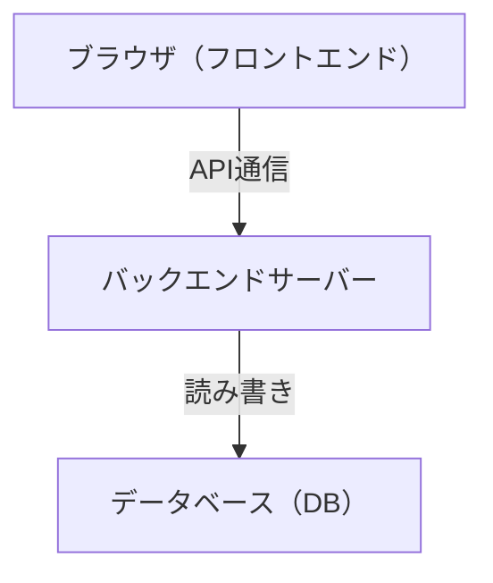
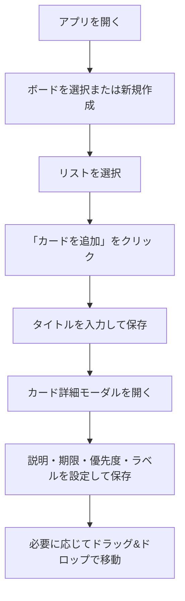
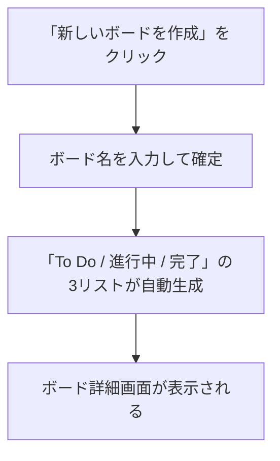
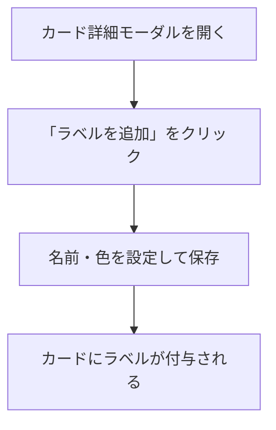

# 要件定義書

## プロジェクト概要

| 項目 | 内容 |
|---|---|
| プロジェクト名 | Trello風タスク管理アプリ |
| 作成日 | 2026-05-07 |
| バージョン | 1.0 |

個人向けTrello風タスク管理Webアプリ。PC・スマートフォンのブラウザで動作する。

---

## 背景・目的

ITスクールのカリキュラム課題として、Webアプリケーション開発の一連の工程（要件定義→設計→実装→テスト）を体験することを目的とする。

題材として、実際に自分が使えるタスク管理アプリを開発する。

---

## ユーザー

- 1人（ログイン不要）

---

## システム構成

フロントエンド・バックエンド・DBの3層構成とする。

---

## ユースケース

| # | アクター | ユースケース |
|---|---|---|
| UC-1 | ユーザー | ボードを作成・切り替え・削除する |
| UC-2 | ユーザー | ボード内にリストを追加・削除・名前変更する |
| UC-3 | ユーザー | リストにカードを追加し、タイトル・説明・期限・優先度を設定する |
| UC-4 | ユーザー | カードにラベルを作成して付与する |
| UC-5 | ユーザー | カードをドラッグ&ドロップでリスト間・リスト内で移動する |
| UC-6 | ユーザー | カードの詳細をモーダルで確認・編集する |
| UC-7 | ユーザー | カードを削除する |

---

## 操作フロー

### メインフロー：カードを作成して管理する

### サブフロー：ボードを新規作成する

### サブフロー：ラベルを作成してカードに付与する

---

## 詳細ドキュメント

| ドキュメント | 内容 |
|---|---|
| [機能要件](functional-requirements.md) | ボード・リスト・カード・ラベルの機能一覧、エラー時の挙動 |
| [画面設計](screen-design.md) | 画面一覧、画面遷移図、各画面のUI仕様 |
| [データベース設計](database.md) | ER図、エンティティ定義、リレーション |
| [非機能要件](non-functional.md) | レスポンシブ・パフォーマンス・ブラウザ対応など |
| [技術選定](tech-stack.md) | 使用技術・フレームワーク・ライブラリの選定 |

---

## スコープ外（将来対応予定）

- 複数人での共有・共同編集
- 通知・リマインダー
- ファイル添付
- 検索・フィルター機能
