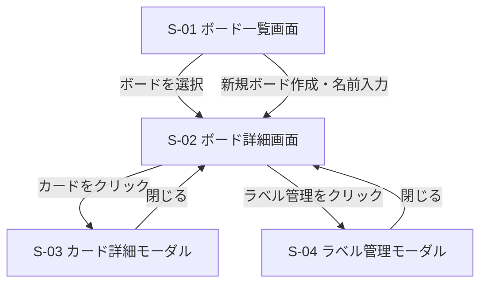

# 画面設計

> 実装状況は2026年6月時点。未実装機能は今後のIssueで対応予定。

## 画面一覧

| 画面ID | 画面名 | 概要 | 実装状況 |
|---|---|---|---|
| S-01 | ボード一覧画面 | 作成済みボードの一覧表示・ボード新規作成 | 一覧表示のみ実装済み。新規作成は未実装（今後の対応） |
| S-02 | ボード詳細画面 | リスト・カードの表示・操作のメイン画面 | 実装済み（リストの追加・削除を除く） |
| S-03 | カード詳細モーダル | カードの詳細表示・編集 | 実装済み（ラベルの追加・編集を除く） |
| S-04 | ラベル管理モーダル | ラベルの作成・削除 | 未実装（今後の対応） |

## 画面遷移図

> S-04への遷移（ラベル管理）、S-01での新規ボード作成、S-02でのリスト追加・削除は未実装（今後の対応）。

## 各画面のUI仕様

### S-01 ボード一覧画面
- ボードをカード形式で一覧表示する
- 各ボードカードにボード名・削除ボタンを表示する（削除ボタンは未実装・今後の対応）
- 「新しいボードを作成」ボタンを表示する（未実装・今後の対応）
- ボード名はクリックでインライン編集できる（未実装・今後の対応）

### S-02 ボード詳細画面
- ヘッダーにボード名・ボード一覧への戻るリンクを表示する
- リストを横並びで表示する
- 各リストにリスト名・カード一覧・「カードを追加」ボタン・リスト削除ボタンを表示する（リスト削除ボタンは未実装・今後の対応）
- 「リストを追加」ボタンを最右端に表示する（未実装・今後の対応）
- カードにはタイトル・優先度・期限・ラベルをコンパクトに表示する
- カードはドラッグ&ドロップで移動可能（手動並び替えモード時のみ）
- 各リストのヘッダーに「優先度」「期限」並び替えボタンを表示する
  - ボタンをクリックするとそのリストのカードが該当順に並び替わり、ボタンがアクティブ表示になる
  - アクティブなボタンを再クリックすると手動並び替えモードに戻る
  - 並び替えはリストごとに独立して設定できる

### S-03 カード詳細モーダル
- タイトル（必須・テキスト入力）
- 説明文（任意・テキストエリア）
- 期限（任意・日付ピッカー）
- 優先度（任意・高/中/低のセレクト）
- ラベル（任意・付与済みラベル表示＋追加ボタン）（ラベルは表示のみ実装済み。追加・編集ボタンは未実装・今後の対応）
- 削除ボタン・閉じるボタン（削除ボタンは2段階確認付きで実装済み）
- 変更の保存タイミングは基本設計フェーズで決定する

### S-04 ラベル管理モーダル（未実装・今後の対応）
- 既存ラベル一覧（名前・色・削除ボタン）
- 新規ラベル作成フォーム（名前入力・カラーピッカー・追加ボタン）
