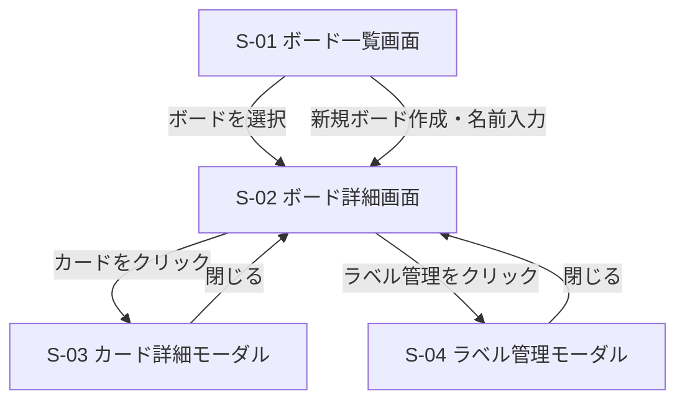

# 画面設計

## 画面一覧

| 画面ID | 画面名 | 概要 |
|---|---|---|
| S-01 | ボード一覧画面 | 作成済みボードの一覧表示・ボード新規作成 |
| S-02 | ボード詳細画面 | リスト・カードの表示・操作のメイン画面 |
| S-03 | カード詳細モーダル | カードの詳細表示・編集 |
| S-04 | ラベル管理モーダル | ラベルの作成・削除 |

## 画面遷移図

## 各画面のUI仕様

### S-01 ボード一覧画面
- ボードをカード形式で一覧表示する
- 各ボードカードにボード名・削除ボタンを表示する
- 「新しいボードを作成」ボタンを表示する
- ボード名はクリックでインライン編集できる

### S-02 ボード詳細画面
- ヘッダーにボード名・ボード一覧への戻るリンクを表示する
- リストを横並びで表示する
- 各リストにリスト名・カード一覧・「カードを追加」ボタン・リスト削除ボタンを表示する
- 「リストを追加」ボタンを最右端に表示する
- カードにはタイトル・優先度・期限・ラベルをコンパクトに表示する
- カードはドラッグ&ドロップで移動可能

### S-03 カード詳細モーダル
- タイトル（必須・テキスト入力）
- 説明文（任意・テキストエリア）
- 期限（任意・日付ピッカー）
- 優先度（任意・高/中/低のセレクト）
- ラベル（任意・付与済みラベル表示＋追加ボタン）
- 削除ボタン・閉じるボタン
- 変更の保存タイミングは基本設計フェーズで決定する

### S-04 ラベル管理モーダル
- 既存ラベル一覧（名前・色・削除ボタン）
- 新規ラベル作成フォーム（名前入力・カラーピッカー・追加ボタン）
